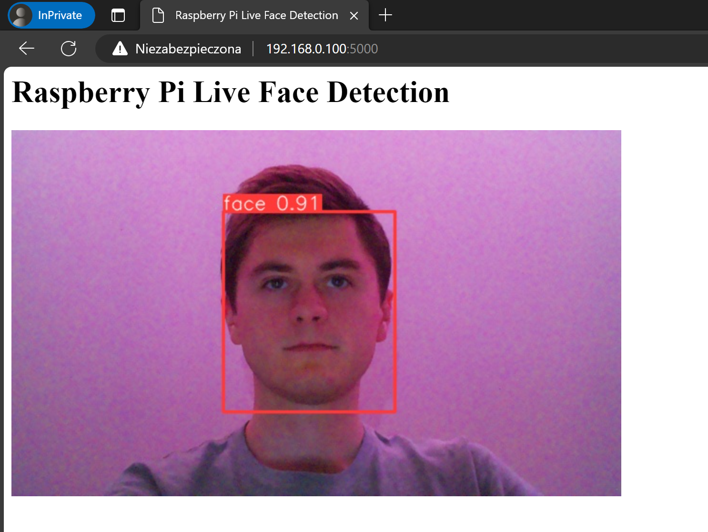
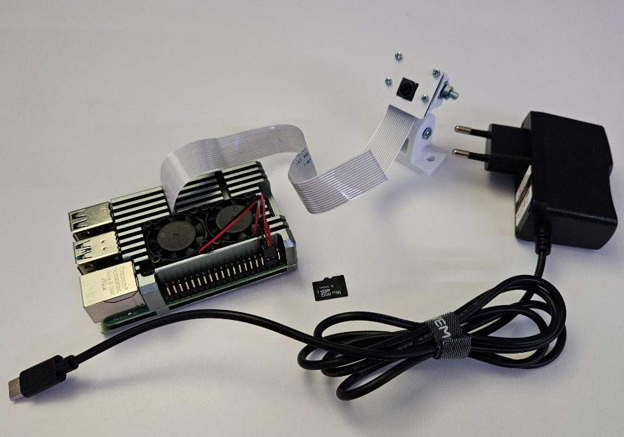
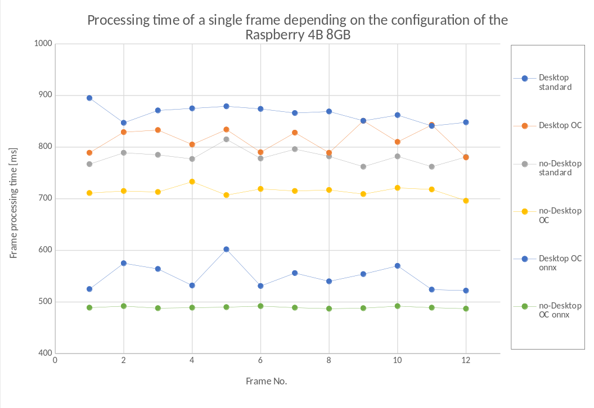
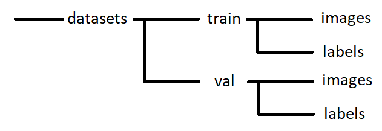

<a id="readme-top"></a>

<br />
<div align="center">
  <a href="https://github.com/github_username/repo_name">
    
  </a>

  <h3 align="center">YoloV8 on Raspberry</h3>

  <p align="center">
    Run custom pretrained model of Yolo on your Raspberry Pi!
  </p>
</div>


<!-- TABLE OF CONTENTS -->
<details>
  <summary>Table of Contents</summary>
  <ol>
    <li>
      <a href="#about-the-project">About The Project</a>
      <ul>
        <li><a href="#built-with">Built With</a></li>
      </ul>
    </li>
    <li>
      <a href="#getting-started">Getting Started</a>
      <ul>
        <li><a href="#prerequisites">Prerequisites</a></li>
        <li><a href="#installation">Installation</a></li>
      </ul>
    </li>
    <li><a href="#usage">Usage</a></li>
    <li><a href="#roadmap">Roadmap</a></li>
    <li><a href="#contributing">Contributing</a></li>
    <li><a href="#license">License</a></li>
    <li><a href="#contact">Contact</a></li>
    <li><a href="#acknowledgments">Acknowledgments</a></li>
  </ol>
</details>


## About The Project

<div style="display: flex; justify-content: space-around">
    
    
</div>


<br>

<iframe width="560" height="315" src="https://youtu.be/TqtyKohOvTY" frameborder="0" allowfullscreen></iframe>

### Built With

* [Yolo V8 - ultralytics][yolo-docs]
* [Raspberry PI 4B 8GB] with camera 
* [2023-10-10-raspios-bookworm-armhf-lite.img.xz]
* [PyTorch]
* [Training Dataset form roboflow][dataset-url]
  

<p align="right">(<a href="#readme-top">back to top</a>)</p>


## Quick start

Here is simple instruction for test run face recognition model on your raspberry. For more details scroll down.

### Prerequisites

For better performance I recomend using 'lite' distros of Raspberry PI OS [see metrics]. I have tested it using 2023-10-10-raspios-bookworm-armhf-lite


### Installation
0. Connect raspi to your Wi-Fi and get local ip adress:
   ```
   ip addr show
   ```
1. Clone the repo
   ```sh
   git clone https://github.com/github_username/repo_name.git
   ```
2. Install python package for piCamera:
   ```sh
   sudo apt-install python3-picamera2
   ```
3. Create virtual enviroment for python installation and allow site packages to perform access venv to camera driver
   ```sh
   python3 -m venv YOLO --system-site-packages
   source YOLO/bin/activate/
   ```

4. Install pip packages
   ```sh
   pip install -r ./requirments.txt
   ```
5. Run server
   ```sh
   python ./Raspi/run-raspi-flask.py
   ```
6. Connect to Wi-Fi with another device and connect to your raspi address on port 5000 (on default):
   ```sh
   <ip addres from 0. step>:5000
   ```

<p align="right">(<a href="#readme-top">back to top</a>)</p>

## Performance

The final step is the conversion of the model extension. YOLO, when trained with
using PyTorch, it saves the model in .pt extension, a format dedicated to
running on CUDA cores, that is, mainly using a graphics card. In addition,
allows further refinement of the model by resuming training with new data, for example. Using a small program containing the YOLO library function
was converted to the .onnx format, which is dedicated to running and fully
use of the CPU's computing power.

In between enhancements, measurements were made of the time it took for the model to
YOLOv8 performed the processing. To measure this, the parameter “verbose” was used,
which, when set to the True state, returned to the terminal a summary of each
operation performed. 

<div align="center">
  
</div>

- `Desktop` is grafical version of Raspi OS, `no-Dektop` means Raspi OS Lite
- `Standard`/`OC` means the state before and after [overclocking](#oveclocking---oc)
- `onnx` stands for networ in `.onnx` format, elsewhere is `.pt`

In the first version of `Desktop Standard` the average frame generation time was 864 ms which translates into 1.16 FPS. For the best obtained configuration `no-Desktop OC onnx` this time was reduced to 489 ms which translated to 2.04 FPS. Thus, it was possible to achieve a performance gain of 43.42%.

In each variant, the lowest performance is in the environment with the graphical version of the system, in addition, in the Lite version, subsequent measurements show much greater repeatability, and therefore stability of the entire system operation. The highest jump in performance was obtained after changing the format of the network model to .onnx.
The video shows the best configuration, i.e. the fastest returning result, of the combination of the Raspi Os system in the Lite version, the applied change in Raspberry Pi clocking and the use of the .onnx format network model.

## How to train yolo model with own data?

### Label data
I mostly used data downloaded from the [roboflow][dataset-url] service, but I also added my own faces using the [`labelImg`][labelImg] program. This program is free, it was written in Python 3. Its installation is done with the command: 
```
pip install labelimg
```
Then the launch is invoked with: 
```
labelIMG
```

### Data partitioning

The data is a collection of images in jpg format and txt files describing them. At this stage it is necessary to divide the collection into training and validation parts. Depending on the number of data, the division is made in a ratio of 50% / 50% (for small sets), as the amount of data increases, the validation set can be reduced. My database of about 2200 observations from the point of view of deep learning is small. According to this principle, it was adopted to divide 70% of the data as training, and the rest was allocated to the validation set.  Preparing the data involves creating a folder called datasets, and in it
successively two folders `train` and `val`. In each of them, the `images` and `labels` folders should be created and the images and corresponding labels should be placed in them respectively. The division is shown using only one class. This is not the only possibility, depending on the needs, the user can divide these structures, taking into account the object classes.

<div align="center">
  
</div>

### Yolo model download


### Training

Whole proces is shown in `/PC/training.ipynb`

It is a good idea to start the training process by preparing a YAML file that contains information about the paths to the training data, model, training settings and other optional parameters. 
```
vim data_custom.yaml
```
```yaml
train: .\datasets\train
val: .\datasets\val
nc: 1
names: ['face']
```
The file was saved in the folder where the network model and the data to be learned were collected. 
The parameter “nc” (Number of Classes) defines the number of classes, in this case it will be only the face, so the value is set to “1”. The last required parameter “names” is the names of the classes, for the face “face” is adopted.

Next we can run training process:
```bash
yolo task=detect mode=train epochs=150 imgsz=640 batch=-1 device=0 workers=4 data=data_custom.yaml model=yolov8n.pt
```
Given the arguments: the number of learning epochs, the indication of the YAML file and the model to be trained, the indication of the size of the images in the database and the technical parameters consisting of “batch” which defines the size of the data portion (setting to the value “-1” causes automatic selection), “device” option defines the device for performing GPU calculations and “worker” (the number of learning processes). “Batch” is adjusted to the graphics card's operating memory (VRAM), while increasing the value of ‘worker’ speeds up the learning process, but the limitation is the performance of the CPU and the amount of operating memory (RAM).

The process of learning a deep neural network begins, the duration of which depends on the performance of the computer, the complexity of the dataset and the number of epochs (it can last from tens of minutes to several hours). After each epoch of training, the process checks the fit of the model weights on the validation set. If it is found to have achieved better results than in the
previous iteration, it saves the weights under the name `best.pt` in the location
`./runs/detect/trainX/weights/`. This is also where you should look for the trained model after the process is complete.
The total learning process of 150 epochs took 23 minutes. In terms of deep learning, this is a short time, but the model with the fewest available parameters was chosen, the dataset was not large and complex. The training was carried out on a local PC using a 12GB RTX4070, while if you do not have a powerful enough PC you can use online services such as google colab.


### Check IoU (Intersectionover Union) - optional step

YOLO tests prediction performance using an evaluation metric ( Intersection over Union - IoU). This is a metric that evaluates how well a model's bounding box is determined (convergence with the true human-indicated one). IoU values range from 0 to 1, where 0 indicates no overlap between the prediction and the true indication, a value equal to 1 indicates perfect coverage. Values below 0.5 are considered a very low fit and in many cases disqualify further use of the model. The interval between 0.5 and 0.75 is considered a good fit, while values above are considered very good. In the tests conducted
a result of 0.55897 was obtained, which, in the case of using a network with a small number of parameters and a complex object such as a face, can be considered a good result.
[See more][iou]

```python
from ultralytics import YOLO
model = YOLO('best150.pt')
metrics = model.val()
metrics.box.map
metrics.box.map50
metrics.box.map75
metrics.box.maps
```


### Convert from `.pt` to `.onnx` - optional step

The last step is to convert the model extension, it is optional, but worth doing. See tab [Performance](#performance).

Whole proces is shown in `/PC/export to onnx.ipynb`.


Note that if you want to run this model on nvidia GPU, better stay with `.pt` model.


## More from video

### Oveclocking - OC

Remember to overclock your Raspberry only with cooling, preferably active cooling!

```
sudo vim /boot/config.txt
```

```
over_voltage=6
arm_freq=2000
gpu_freq=750
```

And reboot.

### Autoconnect to wi-fi

```
vim /etc/wpa_supplicant/wpa_supplicant.conf
```

```
network={
ssid="RASPI_CAM"
psk="your_password"
}
```

### Run python script in `venv` at Raspberry boot-up

First preapare bash script to run python program using virtual enviroment:

```bash
#!usr/bin/env bash
set -e
source "/home/wik34/YOLO/bin/activate"
cd "/home/wik34.AI/Flask Raspi/"
python -u run.py
```

Add run priviliges to this script:
```bash
chmod +x /home/wik34/run_at_start.sh
```

Test run:
```bash
sh /home/wik34/run_at_start.sh
```

Next open crontab to schedule script start:
```bash
crontab -e
```

Add this line at the end of the crontab file:
```bash
@reboot bash /home/wik34/run_at_start.sh
```


<!-- LICENSE -->
## License

Distributed under the MIT License. See `LICENSE.txt` for more information.

<p align="right">(<a href="#readme-top">back to top</a>)</p>


<!-- CONTACT -->
## Contact

Wiktor Wrona - wronawiktorit@gmail.com

[![LinkedIn][linkedin-shield]][linkedin-url]

<p align="right">(<a href="#readme-top">back to top</a>)</p>


<!-- MARKDOWN LINKS & IMAGES -->
<!-- https://www.markdownguide.org/basic-syntax/#reference-style-links -->

[linkedin-url]: www.linkedin.com/in/wiktor-wrona-190887239
[product-screenshot]: images/screenshot.png
[yolo-docs]: https://docs.ultralytics.com/
[dataset-url]: https://universe.roboflow.com/mohamed-traore-2ekkp/face-detection-mik1i/dataset/7
[linkedin-shield]: https://img.shields.io/badge/-LinkedIn-black.svg?style=for-the-badge&logo=linkedin&colorB=555
[labelImg]: https://pypi.org/project/labelImg/
[iou]: https://pyimagesearch.com/2016/11/07/intersection-over-union-iou-for-object-detection/